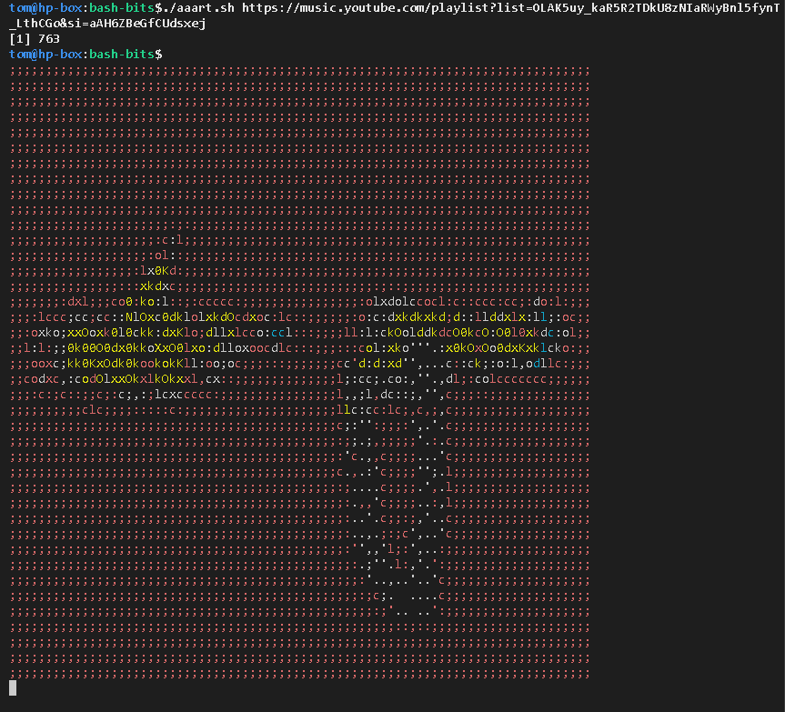

# aaa - ascii album art

### Probably the wrong way to get ascii album art covers to go with yt-dlp (or other) bits...

#### What is it?

* a cursed bash script that outputs a colourised, ASCII representation of a youtube "thumbnail"
* mainly testing this with YouTube Music albums
  * basically are youtube playlists(?)
* probably works with youtube video playists(?)


---

#### But why?

* I use bash scripts for some things that would benefit from having pretty, terminal-friendly album art output
* fun
* to be told all the things I did wrong, for next time.

#### How cursed is it?

Needs:

* yt-dlp
* imagemagick (for "convert". It works so much more nicely than ffmpeg did)


#### How do I use it?

```
./aaart.sh <YOUTUBE_PLAYLIST_URL>

# example
./aaart.sh https://music.youtube.com/playlist?list=OLAK5uy_kaR5R2TDkU8zNIaRWyBnl5fynT_LthCGo&si=aAH6ZBeGfCUdsxej


```





